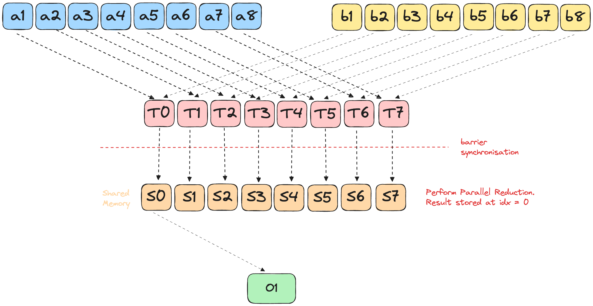
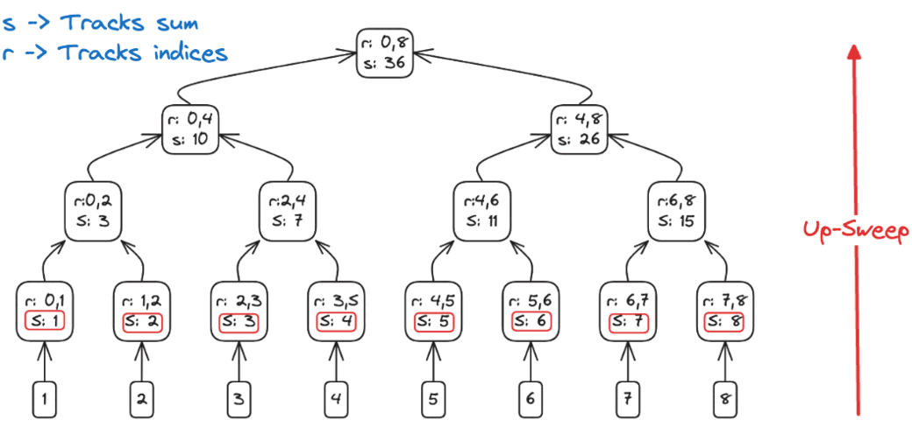
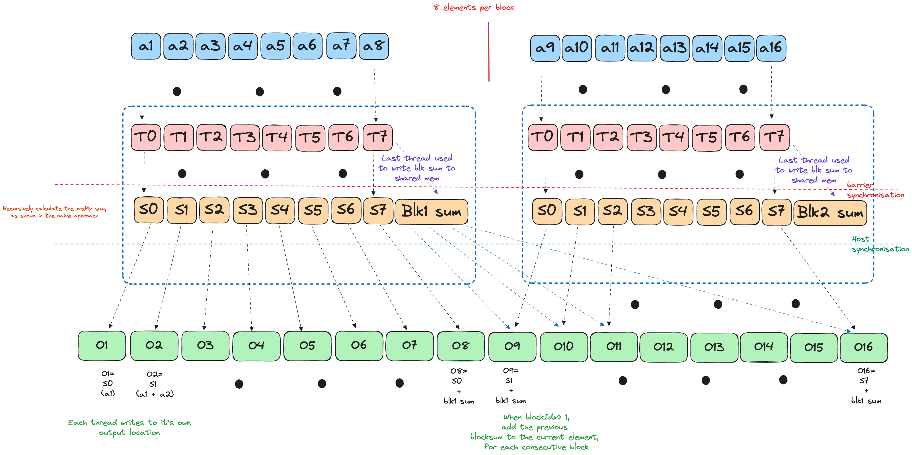

# GPUs go brrr with Mojo: Part 2


- [Puzzle 9: Pooling](#puzzle-09)
- [Puzzle 10: Dot Product](#puzzle-10)
  - [Raw Memory](#raw-memory)
  - [LayoutTensor](#layouttensor)
- [Puzzle 11: 1D Convolution](#puzzle-11)
  - [Simple: Single Block with Shared
    Memory](#simple-single-block-with-shared-memory)
    - [@parameter : Loop Unrolling](#parameter--loop-unrolling)
  - [Advanced: Block Boundary](#advanced-block-boundary)
- [Bonus: 2D Convolution](#bonus-2d-convolution)
- [Puzzle 12: Prefix Sum](#puzzle-12)
  - [Hillis–Steele Algorithm](#hillissteele-algorithm)
  - [Blelloch’s Two‐Pass Algorithm](#blellochs-twopass-algorithm)
  - [Complete Version](#complete-version)
- [Citation](#citation)

This section primarily aims to implement basic algorithms used in
building models, such as pooling, convolutions, etc.

# [Puzzle 9: Pooling](https://builds.modular.com/puzzles/puzzle_09/puzzle_09.html)

Pooling is a classic trick in neural networks for shrinking down your
data—think of it as a way to “summarize” regions of an image or tensor.
Instead of looking at every single pixel, pooling (like max or average
pooling) slides a window over your data and grabs just the most
important info from each patch. On GPUs, pooling is a perfect fit: each
thread can independently process a window, so you get massive
parallelism and a big speedup compared to CPUs.

This puzzle is a bit different compared to traditional pooling: Instead
of having a “kernel”, each output element is the running sum of the all
the elements in the current window.


<details open>
<summary>
**Solution**
</summary>

<div class="code-with-filename">

**p09.mojo**

``` mojo
alias TPB = 8
alias SIZE = 8
alias BLOCKS_PER_GRID = (1, 1)
alias THREADS_PER_BLOCK = (TPB, 1)
alias dtype = DType.float32


fn pooling(
    out: UnsafePointer[Scalar[dtype]],
    a: UnsafePointer[Scalar[dtype]],
    size: Int,
):
    shared = stack_allocation[
        TPB,
        Scalar[dtype],
        address_space = AddressSpace.SHARED,
    ]()
    global_i = block_dim.x * block_idx.x + thread_idx.x
    local_i = thread_idx.x
    if global_i < size:
        shared[local_i] = a[global_i]

    barrier()

    if global_i < size:
        if local_i - 2 >= 0:
            out[global_i] = (
                shared[local_i - 2] + shared[local_i - 1] + shared[local_i]
            )
        elif local_i - 1 >= 0:
            out[global_i] = shared[local_i - 1] + shared[local_i]
        else:
            out[global_i] = shared[local_i]
```

</div>

``` bash
pixi run p09
# out: HostBuffer([11.0, 11.0, 11.0, 11.0, 11.0, 11.0, 11.0, 11.0])
# expected: HostBuffer([11.0, 11.0, 11.0, 11.0, 11.0, 11.0, 11.0, 11.0])
```

</details>

The LayoutTensor version is nearly identical to the Raw Memory approach,
so we’ll omit the code here for brevity.

# [Puzzle 10: Dot Product](https://builds.modular.com/puzzles/puzzle_10/puzzle_10.html)

The Dot Product of two vectors $a$ and $b$ is defined as \[1\]:

$$
c = a \cdot b = \sum_{i=0}^{n-1} a_i b_i
$$

Similar to the previous puzzles, we can implement the dot-product by
copying data to the shared memory, and running our operations on it.



To implement dot product efficiently on a GPU, we will use **parallel
reduction**. This is a classic pattern for aggregating values (sum, min,
max, etc.) across a large array using many threads. The general flow is:

Picture Zeno’s “half-way” paradox \[2\]: you keep halving the leftover
distance until you’re done. A parallel reduction does the same—each
round halves the number of active threads instead of the distance.


- Every thread multiplies its assigned `a` and `b` elements and writes
  the partial product into shared memory.
- Each reduction round:
  - The active-thread count is cut in half (`stride /= 2`).
  - Each surviving thread adds its value to the partner `stride`
    positions away.
  - A `barrier()` guarantees all writes land before the next
    “half-step.”
- After log₂ (n) halvings, Zeno’s finish line is crossed—thread 0 alone
  holds the final dot-product.

This pattern is fast, highly parallel, and used everywhere in GPU
programming for reductions (sum, min, max, etc).

<div>

</div>

## Raw Memory

<details open>
<summary>
**Solution**
</summary>

<div class="code-with-filename">

**p10.mojo**

``` mojo
fn dot_product(
    output: UnsafePointer[Scalar[dtype]],
    a: UnsafePointer[Scalar[dtype]],
    b: UnsafePointer[Scalar[dtype]],
    size: Int,
):
    shared = stack_allocation[
        TPB, Scalar[dtype], address_space = AddressSpace.SHARED
    ]()

    global_idx = block_dim.x * block_idx.x + thread_idx.x
    local_idx = thread_idx.x
    if global_idx < size:
        shared[local_idx] = a[global_idx] * b[global_idx]

    barrier()

    stride = TPB // 2
    while(stride > 0):
        if local_idx < stride:
            shared[local_idx] += shared[local_idx + stride]
        
        barrier()
        stride = stride // 2
    
    # only allow thread 0 to write result
    if local_idx == 0:
        output[0] = shared[0]
```

</div>

</details>

**Note**: Instead of doing the parallel reduction, we could also
implement the solution using a loop:

``` diff
-    stride = TPB // 2
-    while(stride > 0):
-        if local_idx < stride:
-            shared[local_idx] += shared[local_idx + stride]
-        
-        barrier()
-        stride = stride // 2
-    
-    # only allow thread 0 to write result
-    if local_idx == 0:
-        output[0] = shared[0]
+    if global_idx < size:
+        for idx in range(size):
+            output[0] = output[0] + shared[idx]
```

While this approach also gives the correct answer for this puzzle, it
has multiple problems:

- **Race conditions**: Multiple threads would simultaneously try to
  update output\[0\] without synchronization, causing lost updates.
- **Thread divergence**: When threads in a warp take different execution
  paths (some running the loop, others not), the GPU must serialize
  execution, destroying parallelism.
- **Redundant computation**: Every qualifying thread would compute the
  exact same sum over the entire array, wasting compute resources.
- **Memory bottleneck**: Repeated atomic operations to the same memory
  location (output\[0\]) create severe contention.

## LayoutTensor

alias TPB = 8 alias SIZE = 8 alias BLOCKS_PER_GRID = (1, 1) alias
THREADS_PER_BLOCK = (SIZE, 1) alias dtype = DType.float32 alias layout =
Layout.row_major(SIZE) alias out_layout = Layout.row_major(1)

<details open>
<summary>
**Solution**
</summary>

<div class="code-with-filename">

**p10.mojo**

``` mojo
fn dot_product[
    in_layout: Layout, out_layout: Layout
](
    output: LayoutTensor[mut=True, dtype, out_layout],
    a: LayoutTensor[mut=True, dtype, in_layout],
    b: LayoutTensor[mut=True, dtype, in_layout],
    size: Int,
):
    # Use LayoutTensorBuilder instead of stack_allocation
    shared = tb[dtype]().row_major[TPB]().shared().alloc()
    global_idx = block_dim.x * block_idx.x + thread_idx.x
    local_idx = thread_idx.x

    if global_idx < size:
        shared[local_idx] = a[global_idx] * b[global_idx]

    barrier()

    stride = TPB // 2
    while(stride > 0):
        if local_idx < stride:
            shared[local_idx] += shared[local_idx + stride]
        
        barrier()
        stride = stride // 2
    
    # only allow thread 0 to write result
    if local_idx == 0:
        output[0] = shared[0]
```

</div>

</details>

# [Puzzle 11: 1D Convolution](https://builds.modular.com/puzzles/puzzle_11/puzzle_11.html)

Picture sliding a magnifying glass along a long strip of film. That’s
exactly what a 1-D convolution does to any 1-D signal—audio samples, DNA
bases, even bytes of log data.

- The kernel (a small weight vector) glides over the sequence one step
  at a time (or more if you set stride \> 1).
- At each stop it multiplies the local window by its weights, sums the
  result, and drops a single number into the output map.
- Stack layers and you grow the “what can I see at once?” window (the
  receptive field) without blowing up parameters.

**Why bother?**

- **Speed**: A conv layer is just a batched matrix-mul—GPU catnip.
- **Locality first, context later**: Early layers grab short-range
  patterns (phonemes, k-mers). Deeper layers stitch them into bigger
  motifs (words, promoters).
- **Channels generalize it**: You convolve along length, but for each
  input channel you keep separate weights, sum across channels, and spit
  out new feature maps. Same trick as 2-D CNNs, just flattened.

For a better picture, see Ayush’s blog\[3\] on convolutions.

The convolution operation can be defined as:
<span id="eq-convolution">$$
    (input\_signal\_a * kernel\_b)[i] = \sum_{j=0}^{\text{kernel\_size}-1} input\_signal\_a[i + j] * kernel\_b[j]
 \qquad(1)$$</span>

## Simple: Single Block with Shared Memory

For this version, we assume that we only have a single block, and both
the input data and the kernel fit within a block.


The implementation is:

- Intialise shared memory for both the input and the kernel
- Load data in the shared memory, and use `barrier()` to sync all
  threads before performing computations.
- In a loop, multiple the value of input and kernel, and add to a local
  variable.
- Assign the local variable to the right output index.

<details open>
<summary>
**Solution**
</summary>

<div class="code-with-filename">

**p11.mojo**

``` mojo
alias TPB = 8
alias SIZE = 6
alias CONV = 3
alias BLOCKS_PER_GRID = (1, 1)
alias THREADS_PER_BLOCK = (TPB, 1)
alias dtype = DType.float32
alias in_layout = Layout.row_major(SIZE)
alias out_layout = Layout.row_major(SIZE)
alias conv_layout = Layout.row_major(CONV)


fn conv_1d_simple[
    in_layout: Layout, out_layout: Layout, conv_layout: Layout
](
    output: LayoutTensor[mut=False, dtype, out_layout],
    a: LayoutTensor[mut=False, dtype, in_layout],
    b: LayoutTensor[mut=False, dtype, conv_layout],
):
    global_i = block_dim.x * block_idx.x + thread_idx.x
    local_i = thread_idx.x
    # This is oversized! I've explained it later :)
    shared_a = tb[dtype]().row_major[TPB]().shared().alloc()
    shared_b = tb[dtype]().row_major[TPB]().shared().alloc()

    # This can also be optimised, as shown later.
    if global_i < SIZE:
        shared_a[local_i] = a[global_i]
        shared_b[local_i] = b[global_i]
    

    barrier()

    if global_i < SIZE:

        # Ensure the local var has the same type as the output
        # to avoid type casting errors.
        var local_sum: output.element_type = 0

        # Perform loop unrolling.
        @parameter
        for j in range(CONV):
            if local_i + j < SIZE:
                local_sum += shared_a[local_i + j] * shared_b[j]
            barrier()
        
        output[global_i] = local_sum
```

</div>

</details>

I deliberately allocate `shared_a` and `shared_b` with the block width
(`TPB`) instead of the input length (`SIZE`) and filter length (`CONV`).
The extra space isn’t needed for correctness—the kernel only touches the
first `SIZE`/`CONV` elements—but it nicely demonstrates `LayoutTensor`’s
masking: out-of-range indices are silently ignored. This trick keeps the
buffer shape uniform across puzzles without cluttering the code with
edge-case branches. The flip side is a bit of wasted shared memory,
which can pinch if your kernel is already pushing the SRAM limit.

The *optimal* allocation of shared memory would be:

``` diff
-    shared_a = tb[dtype]().row_major[TPB]().shared().alloc()
-    shared_b = tb[dtype]().row_major[TPB]().shared().alloc()
+    # Allocate exactly SIZE elements → smaller shared-mem footprint
+    shared_a = tb[dtype]().row_major[SIZE]().shared().alloc()
+    # Allocate exactly CONV elements → smaller shared-mem footprint
+    shared_b = tb[dtype]().row_major[CONV]().shared().alloc()
...

-    if global_i < SIZE:
-        shared_a[local_i] = a[global_i]
-        shared_b[local_i] = b[global_i]
+    if global_i < SIZE:
+        shared_a[local_i] = a[global_i]
+    if global_i < CONV:
+        shared_b[local_i] = b[global_i]
```

### @parameter : Loop Unrolling

[`@parameter`](https://docs.modular.com/mojo/manual/decorators/parameter/)
is Mojo’s implementation of **loop unrolling**. This has the same
functionality as `pragma unroll(N)` in CUDA.

When unroll is in effect, the optimizer determines and applies the best
unrolling factor for each loop; in some cases, the loop control might be
modified to avoid unnecessary branching. The compiler remains the final
arbiter of whether the loop is unrolled\[4\].

`@parameter` isn’t limited to loops/branches—you can slap it on an inner
function and Mojo will build a **parametric closure**, defined as\[5\]:

> A parametric closure is a nested function decorated with `@parameter`.
> Any values it captures from the surrounding scope are treated as
> compile-time constants. The compiler materialises one specialised
> version of the closure for every distinct set of captured values

Example:

<div class="code-with-filename">

**parametric_closure.mojo**

``` mojo
fn make_shift(off: Int):
    @parameter            # ← specialised per ‘off’
    fn shift(x: Int) -> Int:
        return x + off
    return shift

let s1 = make_shift(1)    # emits shift-$off=1
let s4 = make_shift(4)    # emits shift-$off=4
```

</div>

No runtime captures, no heap boxing—the constant `off` is literally
spliced into the generated IR, so calls to `s1`/`s4` inline like normal
code and can be further unrolled or constant-folded.

Why is this safe? Mojo’s *origin* system\[6\] assigns each compile-time
constant its own immutable origin. The closure therefore can’t outlive
or mutate the thing it captured; once the surrounding scope ends those
origins die too, guaranteeing that the specialised code never touches
expired storage.

**Bottom line**: you get closure ergonomics plus “zero-cost
abstraction”\[7\] performance—ideal for GPU kernels where every cycle
and register matters.

## Advanced: Block Boundary

We now aim to perform convolution over an input that is larger than a
single block. Due to the nature of convolution operation, this
introduces interesting boundary conditions. Specifically, the output of
block N now depends on block N - 1, when N \> 1.

The blue cells are the data *owned* by the current thread-block; the
orange cells are the first few elements of the *next* block that the
convolution window will inevitably peek at.


**Problem statement**

Run a 1-D convolution with a `CONV₂`-tap kernel over an input that is
longer than one block (`TPB` threads). We want every thread to:

• pull data from **shared memory only** (once it’s loaded, stay
in-block)  
• avoid divergent branches and random global reads  
• keep the load pattern fully coalesced

Naïve global loads meet none of those goals—once a window crosses the
block edge the tail threads must issue conditional, *straggling* reads
(i.e. each thread grabs a lone, scattered element from global memory
instead of part of one tidy, coalesced burst).

**The halo idea**

Give each block an in-block “fence extension”:

    shared_a = …[TPB + (CONV₂ − 1)]   # main slice + halo

The extra `(CONV₂ − 1)` slots—the *halo*—mirror the first `(CONV₂ − 1)`
elements of the next block (or zeros if we’re already at EOF). That
single change guarantees that every sliding window lives in one
contiguous span of shared memory.

The elements that are involved in multiple tiles and loaded by multiple
blocks are commonly referred to as *halo cells* or *skirt cells* since
they “hang” from the side of the part that is used solely by a single
block\[8\].

Loading recipe (matches the numbered arrows in the figure):

1.  **Bulk copy** – all `TPB` threads dump their element:  
    `shared_a[t] = a[blockStart + t]`
2.  **Halo fill** – threads `t < (CONV₂ − 1)` copy the tail:  
    `shared_a[TPB + t] = (a[blockStart + TPB + t] if in-range else 0)`
3.  **Kernel stash** – threads `t < CONV₂` cache the weights:  
    `shared_b[t] = b[t]`
4.  `barrier()` – everyone syncs

After step 4 every thread sees:

          main slice              halo
    [ … local_i … TPB − 1 | TPB … TPB+CONV₂−2 ]

Code to perform the actual computation is the same as in [Puzzle
10](#puzzle-10).

One barrier, no branches and 100 % shared-memory hits ensure our kernel
is fast and efficient!

<details open>
<summary>
**Solution**
</summary>

<div class="code-with-filename">

**p11_block_boundary.mojo**

``` mojo
alias SIZE_2 = 15
alias CONV_2 = 4
alias BLOCKS_PER_GRID_2 = (2, 1)
alias THREADS_PER_BLOCK_2 = (TPB, 1)
alias in_2_layout = Layout.row_major(SIZE_2)
alias out_2_layout = Layout.row_major(SIZE_2)
alias conv_2_layout = Layout.row_major(CONV_2)

fn conv_1d_block_boundary[
    in_layout: Layout, out_layout: Layout, conv_layout: Layout, dtype: DType
](
    output: LayoutTensor[mut=False, dtype, out_layout],
    a: LayoutTensor[mut=False, dtype, in_layout],
    b: LayoutTensor[mut=False, dtype, conv_layout],
):
    global_i = block_dim.x * block_idx.x + thread_idx.x
    local_i  = thread_idx.x

    # input slice + halo
    shared_a = tb[dtype]().row_major[TPB + CONV_2 - 1]().shared().alloc()

    # load kernel
    shared_b = tb[dtype]().row_major[CONV_2]().shared().alloc()

    if global_i < SIZE_2:
        # coalesced load of main slice
        shared_a[local_i] = a[global_i]                  

    # only first CONV_2 threads participate
    if local_i < CONV_2:
        # load kernel into shared memory
        shared_b[local_i] = b[local_i]                   

    # threads responsible for halo load
    if local_i < CONV_2 - 1:
        # element that lives in next block
        var next_idx = global_i + TPB                    
        # pad with zeros
        shared_a[local_i + TPB] = a[next_idx] if next_idx < SIZE_2 else 0.0

    barrier()

    # skip threads mapping past the end
    if global_i < SIZE_2:
        var local_sum: output.element_type = 0.0

        @parameter                                       
        for j in range(CONV_2):                          
            # dot product of window & kernel
            local_sum += shared_a[local_i + j] * shared_b[j]
        output[global_i] = local_sum
```

</div>

``` bash
pixi run p11 --block-boundary
# out: HostBuffer([14.0, 20.0, 26.0, 32.0, 38.0, 44.0, 50.0, 56.0, 62.0, 68.0, 74.0, 80.0, 41.0, 14.0, 0.0])
# expected: HostBuffer([14.0, 20.0, 26.0, 32.0, 38.0, 44.0, 50.0, 56.0, 62.0, 68.0, 74.0, 80.0, 41.0, 14.0, 0.0])
```

</details>

# Bonus: 2D Convolution

We can extend our implementation for 1D convolution to a 2D convolution.


Everything is exactly the same idea as 1-D, only now we have two spatial
dims:

- We launch a 2D grid of `(ceildiv(WIDTH,TPB_X), ceildiv(HEIGHT,TPB_Y))`
  blocks of TPB_X×TPB_Y threads.
- Each block allocates a shared tile of size `(TPB_Y+K−1)×(TPB_X+K−1)`
  to hold its “main” patch plus a one‐pixel halo on the bottom/right.
- We also stash the full `K×K` kernel into shared_k.
- After a single barrier(), each thread does two nested `@parameter`
  loops over `ky,kx∈[0,K)` to compute a dot‐product.

<details open>
<summary>
**Solution**
</summary>

<div class="code-with-filename">

**p11_conv_2d.mojo**

``` mojo
from math import ceildiv
...

alias TPB_X = 8
alias TPB_Y = 8
alias WIDTH = 16
alias HEIGHT = 12
alias K     = 3
alias BLOCKS_PER_GRID_2D  = (ceildiv(WIDTH, TPB_X),  ceildiv(HEIGHT, TPB_Y))
alias THREADS_PER_BLOCK_2D = (TPB_X, TPB_Y)

fn conv_2d_halo[
    in_layout : Layout, out_layout : Layout,
    k_layout  : Layout, dtype : DType
](
    output : LayoutTensor[mut=False, dtype, out_layout],
    inp    : LayoutTensor[mut=False, dtype, in_layout],
    kernel : LayoutTensor[mut=False, dtype, k_layout],
):
    let gx = block_idx.x * block_dim.x + thread_idx.x
    let gy = block_idx.y * block_dim.y + thread_idx.y
    let lx = thread_idx.x
    let ly = thread_idx.y

    const TILE_W = TPB_X + K - 1
    const TILE_H = TPB_Y + K - 1

    # allocate (main + halo) + kernel
    shared_img = tb[dtype]().row_major[TILE_H, TILE_W]().shared().alloc()
    shared_k   = tb[dtype]().row_major[K,K]().shared().alloc()

    # 1) bulk copy
    if gx < WIDTH && gy < HEIGHT:
        shared_img[ly, lx] = inp[gy, gx]
    else:
        shared_img[ly, lx] = 0.0

    # 2) halo copy (strided so we cover the whole TILE_H/TILE_W)
    var hy = ly
    while hy < TILE_H:
        var hx = lx
        let gy2 = block_idx.y * block_dim.y + hy
        while hx < TILE_W:
            let gx2 = block_idx.x * block_dim.x + hx
            shared_img[hy, hx] = (
                inp[gy2, gx2] if (gy2 < HEIGHT && gx2 < WIDTH) else 0.0
            )
            hx += TPB_X
        hy += TPB_Y

    # 3) stash the kernel
    if ly < K && lx < K:
        shared_k[ly, lx] = kernel[ly, lx]

    barrier()  # sync both shared buffers

    # 4) compute 3×3 dot‐product
    if gx < WIDTH && gy < HEIGHT:
        var sum: Float32 = 0.0
        @parameter 
        for ky in range(K):
            @parameter 
            for kx in range(K):
                sum += shared_img[ly + ky, lx + kx] * shared_k[ky, kx]
        output[gy, gx] = sum
```

</div>

</details>

After making a [few
changes](https://github.com/goodhamgupta/mojo-gpu-puzzles/commit/b7961ce0e5ea8753a866cbf671881ac1bdf4acd9)
to the test harness, we get the following result:

``` bash
pixi run p11 --conv-2d
# out: HostBuffer([9.0, 9.0, 9.0, 9.0, 9.0,...,6.0, 3.0, 6.0, 6.0, 6.0, 6.0, 6.0, 6.0, 6.0, 6.0, 6.0, 6.0, 6.0, 6.0, 6.0, 6.0, 4.0, 2.0, 3.0, 3.0, 3.0, 3.0, 3.0, 3.0, 3.0, 3.0, 3.0, 3.0, 3.0, 3.0, 3.0, 3.0, 2.0, 1.0])
# expected: HostBuffer([9.0, 9.0, 9.0, 9.0, 9.0,..., 6.0, 6.0, 6.0, 6.0, 6.0, 6.0, 6.0, 6.0, 6.0, 6.0, 6.0, 6.0, 6.0, 6.0, 4.0, 2.0, 3.0, 3.0, 3.0, 3.0, 3.0, 3.0, 3.0, 3.0, 3.0, 3.0, 3.0, 3.0, 3.0, 3.0, 2.0, 1.0])
```

# [Puzzle 12: Prefix Sum](https://builds.modular.com/puzzles/puzzle_12/puzzle_12.html)

The **prefix sum** (or *scan*) problem takes an input array
`[a₀, a₁, …, aₙ₋₁]` and produces the running totals

``` text
[a₀, (a₀ ⊕ a₁), …, (a₀ ⊕ a₁ ⊕ … ⊕ aₙ₋₁)]
```

It’s a foundational primitive in parallel computing—used for stream
compaction, sorting, histograms, and more. At first glance, prefix sum
looks inherently serial (each output depends on all previous inputs),
but clever algorithms can parallelize it efficiently.


</details>

## Hillis–Steele Algorithm

A straightforward parallel scan is the *Hillis–Steele* approach: at each
distance `d = 1, 2, 4, …` every element adds in the value from `d`
positions back. This is the same as the method shown in [Puzzle
10](#puzzle-10)

``` python
# inclusive scan, power-of-two length
def hillis_steele_scan(a, ⊕):
    n = len(a)
    temp = a.copy()
    d = 1
    while d < n:
        for i in range(n):
            temp[i] = a[i] if i < d else a[i - d] ⊕ a[i]
        a, temp = temp, a
        d *= 2
    return a
```

In Mojo, this looks as follows:

<details open>
<summary>
**Solution**
</summary>

<div class="code-with-filename">

**p12_simple.mojo**

``` mojo
fn prefix_sum_simple[
    layout: Layout
](
    output: LayoutTensor[mut=False, dtype, layout],
    a: LayoutTensor[mut=False, dtype, layout],
    size: Int,
):
    global_i = block_dim.x * block_idx.x + thread_idx.x
    local_i = thread_idx.x
    for idx in range(Int(log2(Scalar[dtype](TPB)))):
        if local_i >= offset and local_i < SIZE:
            shared[local_i] += shared[local_i - offset]

        barrier()
        offset *= 2

    if global_i < SIZE:
        output[global_i] = shared[local_i]
```

</div>

``` bash
pixi run p12 --simple
# out: HostBuffer([0.0, 1.0, 3.0, 6.0, 10.0, 15.0, 21.0, 28.0])
# expected: HostBuffer([0.0, 1.0, 3.0, 6.0, 10.0, 15.0, 21.0, 28.0])
```

Each of the log₂(n) rounds does up to n parallel additions (one per
active element), so total work is $\sum_k n = nlog(n)$. Because rounds
are serialized by barriers, the longest dependency chain is one add per
round i.e $O(log n)$.

## Blelloch’s Two‐Pass Algorithm

Blelloch’s two-pass scan does Θ(n) work by splitting the job into an
**up-sweep** (build a reduction tree) and a **down-sweep** (propagate
prefixes) \[9\].

Why prefer it over the classic Hillis–Steele (Algorithm 1)?

1.  Hardware reality.  
    Hillis–Steele assumes one processor per element and updates the
    array *in-place* every round.  
    A real GPU doesn’t grant that luxury: a “1 024-thread” block
    actually runs in 32-thread warps that time-slice on the same SM.
    When warp 0 pauses and warp 1 resumes, in-place writes from one warp
    can overwrite data the other still needs.

2.  Synchronisation cost.  
    Avoiding the overwrite requires a barrier after **every**
    addition—log₂(n) rounds × n threads ⇒ Θ(n log n) operations plus all
    those barriers.

3.  Blelloch’s fix.  
    • Up-sweep and down-sweep touch disjoint tree levels, so threads
    never trample each other within a phase.  
    • Only two global barriers are needed (one between the phases, one
    at the end).  
    • Work drops to Θ(n) and correctness is guaranteed even when the
    array is far larger than a warp.

The result is a scan that is both faster and safer on modern GPUs.

1.  **Up-sweep (reduce)**

    - Build a binary reduction tree over log₂(n) rounds:
      - Round 1 (step=1): sum each adjacent pair, storing results at
        indices 1, 3, 5, …
      - Round 2 (step=2): merge those partial sums into blocks of 4,
        writing into indices 3, 7, 11, …
      - Continue doubling the span each round until step = n/2
    - After the final round, a\[n-1\] holds the overall total

     *Up-Sweep: combining elements in a
    binary-tree fashion—build partial sums until the final element holds
    the total.*

2.  **Down-sweep (propagate)**  
    After the up-sweep leaves `a[n-1]` containing the overall sum, we
    walk the tree top-down to scatter prefix sums into every slot:

    - Initialize the down-sweep with a window size of `step = n/2`.  
    - Loop as long as `step >= 1`:
      - Partition the array into blocks of size `2*step`. For each block
        starting at index `i`:  
        • Temporarily store the left-child total from
        `a[i + step - 1]`.  
        • Overwrite that left slot with the right-child subtotal from
        `a[i + 2*step - 1]`.  
        • Add the saved left-child total to the right slot, giving the
        correct prefix for that subtree.  
      - Issue a `barrier()` so all threads sync before shrinking the
        window.  
      - Halve the window: `step = step / 2`.  
    - With each pass, the partial sums trickle down one level of the
      binary tree; after log₂(n) iterations every element holds its
      exclusive prefix sum.

      
    *Down Sweep: siblings swap and accumulate, driving the scan from
    root back to leaves.*

Time Complexity: Θ(log₂ n) parallel steps, Work: Θ(n) total operations.

<details open>
<summary>
**Solution (Blelloch up-sweep + down-sweep)**
</summary>

<div class="code-with-filename">

**p12_blelloch.mojo**

``` mojo
fn prefix_sum_blelloch[
    layout: Layout
](
    output:   LayoutTensor[mut=True, dtype, layout],
    a:     LayoutTensor[mut=False, dtype, layout],
    size:  Int,
):
    global_idx = block_idx.x*block_dim.x + thread_idx.x
    local_idx = thread_idx.x
    shared = tb[dtype]().row_major[SIZE]().shared().alloc()

    if global_idx < size:
        shared[local_idx] = a[global_idx]
    barrier()

    # Up-sweep
    var stride = 1
    while stride < size:
        step = stride * 2
        if (local_idx % step == step - 1) and (local_idx < size):
            shared[local_idx] += shared[local_idx - stride]
        barrier()
        stride = step

    # Down-sweep
    if local_idx == size - 1:
        shared[local_idx] = 0
    barrier()

    var half = stride >> 1
    while half > 0:
        step = half * 2
        if (local_idx % step == step - 1) and (local_idx < size):
            t = shared[local_idx - half]
            shared[local_idx - half] = shared[local_idx]
            shared[local_idx] += t
        barrier()
        half = half >> 1

    if global_idx < size:
        output[global_idx] = shared[local_idx] + a[global_idx]
```

</div>

``` bash
pixi run p12 --blelloch
# out: HostBuffer([0.0, 1.0, 3.0, 6.0, 10.0, 15.0, 21.0, 28.0])
# expected: HostBuffer([0.0, 1.0, 3.0, 6.0, 10.0, 15.0, 21.0, 28.0])
```

</details>

This is not the most efficient implementation, but I hope this provides
some intuition about the algorithm!

## Complete Version

The key difference in this version is that now we have an input array
that is larger than the size of a single block.

We split the global scan into two bite-sized passes:

**Phase 1 – Local Scan** 1. Each block copies its slice into shared
memory.  
2. Perform an in-block naive scan/Blelloch scan exactly as in the
single-block case.  
3. The last thread of the block stashes the block’s total **after** the
scan into an auxiliary slot at the tail of `output`:

    #  |<---  SIZE_2  --->|<-- #blocks -->|
    #  [   prefix sums   ][ block totals ]

**Phase 2 – propagate block totals**

1.  Every thread grabs the aggregate from the *previous* block
    (`totals[block_id-1]`) and adds it to its own prefix.  
    Now every element holds the inclusive scan over the *whole* array.



We launch the above phases as two separate kernels.

A host-side synchronisation sits between the launches. That call flushes
the work queue and waits until Phase 1 has fully committed its writes to
global memory, ensuring the per-block totals are complete and visible
before Phase 2 starts consuming them. Skip the sync and the driver is
free to overlap or reorder the kernels, letting Phase 2 read garbage.

<details open>
<summary>
**Solution (Block Boundary Version)**
</summary>

<div class="code-with-filename">

**p12_block_boundary.mojo**

``` mojo
fn prefix_sum_local_phase[
    out_layout: Layout, in_layout: Layout
](
    output: LayoutTensor[mut=False, dtype, out_layout],
    a: LayoutTensor[mut=False, dtype, in_layout],
    size: Int,
):
    global_i = block_dim.x * block_idx.x + thread_idx.x
    local_i = thread_idx.x
    shared = tb[dtype]().row_major[EXTENDED_SIZE]().shared().alloc()

    if global_i < SIZE_2:
        shared[local_i] = a[global_i]
    
    barrier()
    offset = 1

    for idx in range(Int(log2(Scalar[dtype](TPB)))):
        if local_i >= offset and local_i < SIZE_2:
            shared[local_i] += shared[local_i - offset]

        barrier()
        offset *= 2

    if global_i < SIZE_2:
        output[global_i] = shared[local_i]
    
    if local_i == TPB - 1:
        output[size + block_idx.x] += shared[local_i]


# Kernel 2: Add block sums to their respective blocks
fn prefix_sum_block_sum_phase[
    layout: Layout
](output: LayoutTensor[mut=False, dtype, layout], size: Int):
    global_i = block_dim.x * block_idx.x + thread_idx.x
    # FILL ME IN (roughly 3 lines)
    if block_idx.x > 0 and global_i < size:
        prev_block_sum = output[SIZE_2 + block_idx.x - 1]
        output[global_i] += prev_block_sum
```

</div>

``` bash
pixi run p12
# out: HostBuffer([0.0, 1.0, 3.0, 6.0, 10.0, 15.0, 21.0, 28.0, 36.0, 45.0, 55.0, 66.0, 78.0, 91.0, 105.0, 28.0, 77.0]) # last 2 elements are the block sums
# expected: HostBuffer([0.0, 1.0, 3.0, 6.0, 10.0, 15.0, 21.0, 28.0, 36.0, 45.0, 55.0, 66.0, 78.0, 91.0, 105.0])
```

</details>

# Citation

Original puzzles by the [Modular](https://www.modular.com/) team; this
blog provides personal explanations and solutions.

Please cite this work as:

    Gupta, Shubham. “Mojo GPU Puzzles — Solutions & Explanations”. shubhamg.in (June 2025). https://shubhamg.in/posts/mojo-gpu-puzzles

Or use the BibTeX citation:

    @article{sguptamojopuzzles,
      title   = {Mojo GPU Puzzles — Solutions \& Explanations},
      author  = {Gupta, Shubham},
      journal = {shubhamg.in},
      year    = {2025},
      url     = {https://shubhamg.in/posts/mojo-gpu-puzzles},
    }

<div id="refs" class="references csl-bib-body" entry-spacing="0">

<div id="ref-wikipediadotproduct" class="csl-entry">

<span class="csl-left-margin">\[1\]
</span><span class="csl-right-inline">Wikipedia, “Dot product.”
<https://en.wikipedia.org/wiki/Dot_product>, 2024.</span>

</div>

<div id="ref-zeno_dichotomy_paradox" class="csl-entry">

<span class="csl-left-margin">\[2\]
</span><span class="csl-right-inline">Wikipedia, “Zeno’s paradoxes —
dichotomy paradox.”
<https://en.wikipedia.org/wiki/Zeno%27s_paradoxes#Dichotomy_paradox>,
2024.</span>

</div>

<div id="ref-thakur_convolutions" class="csl-entry">

<span class="csl-left-margin">\[3\]
</span><span class="csl-right-inline">A. Thakur, “Intuitive
understanding of 1D, 2D, and 3D convolutions in convolutional neural
networks.” 2020. Available:
<https://wandb.ai/ayush-thakur/dl-question-bank/reports/Intuitive-understanding-of-1D-2D-and-3D-convolutions-in-convolutional-neural-networks---VmlldzoxOTk2MDA></span>

</div>

<div id="ref-nvidiapragmaunroll" class="csl-entry">

<span class="csl-left-margin">\[4\]
</span><span class="csl-right-inline">NVIDIA,
“<span class="nocase">\#pragma unroll Compiler Directive (CUDA C
Programming Guide)</span>.” 2025. Available:
<https://docs.nvidia.com/cuda/cuda-c-programming-guide/index.html?highlight=unroll#pragma-unroll></span>

</div>

<div id="ref-mojoparameter" class="csl-entry">

<span class="csl-left-margin">\[5\]
</span><span class="csl-right-inline">Modular, “Parametric closure
(`@parameter`) in mojo.” 2025. Available:
<https://docs.modular.com/mojo/manual/decorators/parameter/#parametric-closure></span>

</div>

<div id="ref-mojo_lifetimes" class="csl-entry">

<span class="csl-left-margin">\[6\]
</span><span class="csl-right-inline">Modular, “Lifetimes in mojo.”
2025. Available:
<https://docs.modular.com/mojo/manual/values/lifetimes/></span>

</div>

<div id="ref-zero_cost_abstractions" class="csl-entry">

<span class="csl-left-margin">\[7\]
</span><span class="csl-right-inline">saoirse, “Zero cost abstractions.”
2019. Available:
<https://without.boats/blog/zero-cost-abstractions/></span>

</div>

<div id="ref-iitd_parallel_convolution" class="csl-entry">

<span class="csl-left-margin">\[8\]
</span><span class="csl-right-inline">R. Sen, “Parallel convolution.”
2022. Available:
<https://www.cse.iitd.ac.in/~rijurekha/col730_2022/parallelconvolution_aug29.pdf></span>

</div>

<div id="ref-blelloch_prefix_sum" class="csl-entry">

<span class="csl-left-margin">\[9\]
</span><span class="csl-right-inline">G. E. Blelloch, “Prefix sums and
their applications,” in *Synthesis of parallel algorithms*, 1993, pp.
35–60. Available: <https://www.cs.cmu.edu/~guyb/papers/Ble93.pdf></span>

</div>

</div>
