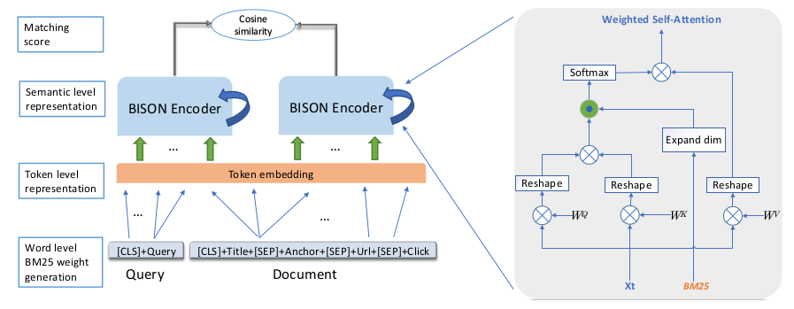
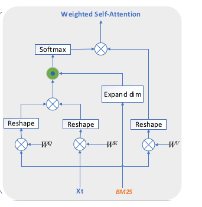

---
aliases:
- /nlp/transformer/review/2020/08/31/bison
author: Shubham Gupta
categories:
- nlp
- transformer
- review
date: '2020-08-31'
description: A new framework for information retrieval from documents
layout: post
title: BERT + BM25 = BISON
toc: true

---

# Introduction
- This paper aims to create a framework to map query and doc into semantic vectors via self-attention models.
- We cant use prior knowledge about important tokens for models based on self-attention.
  - Words are split into different tokens using a tokenization mechanism such as WordPiece. We cannot translate word-level knowledge into different tokens.
- However, from classical information retrieval, we know that prior knowledge about the word is important. For example, ERNIE used a Knowledge Graph to achieve SOTA on several GLUE tasks.
- Furthermore, documents have different fields with varying degrees of importance such as text, header, filetypes, etc. We cannot combine these fields directly because their importance varies for a task. 
- **Key takeaways**:
    - Combine BM25 to learn attention scores with Query(Q) and Key(K) matrices, which are used in self-attention.
    - Word weight sharing to reduce knowledge discrepancy between tokens and words.
    - Combine multiple fields by placing different fields in different segments using a BM25F, a variation of BM25.

# Background
- Using NN for doc retrieval has 2 approaches
  - **Siamese Networks**: In this, we encode the given query $q$ and the document $d$ separately.
  - **Interactive Networks**: In this, we encode the given query $q$ and the document $d$ together.
- For large scale document retrieval tasks dependent on vector search, siamese networks are preferred since we can encode multiple documents without a query offline. This ensures the overall document retrieval process is fast in production.
- BISON is built using a Siamese Network architecture.

# Proposed method
## Overview of BISON

- The framework has 4 important parts: 
  - **Word level BM25**: In this, we prepend the _CLS_ token to the query and use combined fields representation for the documents.
  - **Token level representation**: As is the norm, we will use the token, position and segment embedding
  - **BISON Encoder**: This will encode the query _q_ and the document _d_ into semantic spacy by siamese structure making it possible to serve the model online. The architecture consists of 3 stacked BISON layers.
  - **Scoring**: The documents are scored using the cosine similarity metric.

## BISON Encoder: Weighted Self Attention

- As we know from the original "Attention" paper, attention is computed using the query, key, and value matrices. 
- To the above, we will add the importance of tokens via BM25. We will introduce w_i and multiply with above attention to get new attention score i.e Weighted Self Attention
    $$ A_{ij}^w = w_j\frac{q_i.k_j^T}{\sqrt{d}} $$

- Mathematically, it is represented as:

$$WeightedSelfAttention(Q,K,W,V) = softmax(W (.) \frac{QK^T}{\sqrt{d}}V$$

- WSA is the main block unit. Multiple such units are tacked to get the multi-head structure.
- Rescaling by $W^o$, we get **Complex Weighted Self Attention(CWSA)**.
- A fully connected layer is added. In both CWSA and fully connected layer, layer norm and residual connections are used

$$CWSA = Concat(WeightedSelfAttention1,... WeightedSelfAttention, n)W^o$$

$$CWSA_{out}=LayerNorm(CWSA + X)$$

$$BISONEncoder = LayerNorm(CWSA_{out} + FeedForward(CWSA_{out}))$$

## BM25 Weight generation

- Use BM25 for weight scores in query and BM25F for weight scores in multi-field documents
- BM25F, a variation of BM25, is for documents with different fields, each having different importance in terms of relevance saturation and length normalization. Find additional details in the file [here](https://web.stanford.edu/class/cs276/handouts/lecture12-bm25etc.pdf).

### Inherent Query BM25

- For a given query, BM25 is calculated within the query.
  - $l_q$: query length 
  - $avl_q$: query average length along collection

$$
w_i^{BM25} = idf_i \frac{tf_i}{tf_i + k_1(1-b+b \frac{l_q}{avl_q})}
$$

### Inherent Document BM25F

- BM25F is implemented by assigning different degrees of importance to the different zones in a document such as title, header, footer, filetype, text, etc. For a  $word_j$ in a document field $c$, it's frequency $f_j^c$ is defined as:

$$
atf_j^c = \frac{fw_c . tf_j^c}{1.0 + fln_c . (\frac{fl_c}{avl_c}-1.0)}
$$

- The corresponding BM25F score is computed as

$$
w_j^{BM25F} = idf_j\frac{atf_j}{k_1 + atf_j}
$$

## Whole word weight sharing

- BERT uses wordpiece to produce tokens from raw text. However, because of this, we cannot directly apply the prior knowledge we obtained from B-52.
- **Solution**: Assign the _same_ word weight to all tokens for a given word. This way, a token might have a different weight depending on the context of the given word.

## Combined Fields Representation
- Documents typically consist of different fields, each of which provides complementary information. Thus, these fields need to be taken into consideration. Typical fields considered are:
  -  Primitive Fields(Title, URL, header, etc.)
  -  Other fields(anchor, click signal via parsing search log, etc)

- For the experiment, only the following fields were picked for performance reasons(the body has too much text to encode in a single space):
  - Title
  - Anchor
  - URL
  - Clicked query
- For each field, we learn their representation individually and combine them. Further, we also restrict the number of tokens for each of the above fields to a total of 128 tokens.
  - 20 tokens each for Title, Anchor and URL.
  - Only consider the top 5 clicked queries for a maximum of 68 tokens.
- For given fields, the document representation $\phi(D)$ is given by:

$$
\phi(D) = A_{f_i}(\phi_{F_1}(F_1)+ \phi_{F_2}(F_2)+...+\phi_{F_n}(F_n))
$$

- Here,
  - $F_i$ is the field
  - $\phi(F_1)$ denotes the representation learned for each field $F_i$
  - $A_{f_i}$ is a function to aggregate all representations

- The remaining tokens(512-128=384) are used to encode the query.

## Optimization
- The [CLS] token from the last layer is used as a representation for the query and the document
- Matching score $s$ is computed as:
$$
s = cos(BISON(query)_{last cls}, BISON(document)_{last cls}) 
$$
- Cross entropy loss is used to determine if the retrieved document is relevant or not.
$$
Loss = -ylog(\delta(w.s+b))-(1-y)log(1 - \delta(w.s+b))
$$

# Experimentation

- Datasets used were the Bing internal query set and public datasets.
- Evaluation metrics used are NDCG(normalized Discounted Cumulative Gain) and NCG(Normalized Cumulative Gain) and MRR(Mean Reciprocal Rank)
- **NCE(Noise Contraction Estimation)** 
  - It is used to pick negative samples that are competitive with the correct ones, helping improve the model generalization.
- **Hard negative Integration**
  - Adding negative samples from the clicked documents only helps the model learn entirely non-related query-document pairs.
  - To help learn partially related pairs, queries are samples from the search log, and results from these queries are added to the negative samples set.

# Evaluation
- The following models were used as baselines:
  - TF-IDF and BM25: To present performance for standard information retrieval 
  - USE and C-DSSM: To represent sentence embeddings for information retrieval
  - BERT and XLNET: To represent models from the pre-training era.

## Intrinsic evaluation
- Selected 1400 representative queries and 7 million query document pairs from Bing's search log
- Performance-wise, USE performs the worst as it performs well only on homogeneous data, and query document pairs are heterogeneous.
- BISON outperforms all baseline models significantly.

## MS Marco
- Similar steps followed for document full ranking task on the MS Marco dataset.
- For each query, the top 1000 documents are returned and MR is used as performance metrics.

# Ablation Experiments
- To test the effectiveness of the main parts of BISON, 3 variants are created and tested:
  - BISON$_{tw}$: Use token level weight generation. 
  - BISON$_{us}$: Exclude combined fields representation and use a union segment i.e concatenate all fields as one segment.
  - BISON$_{idf}$: Use IDF as an alternative for BM25

# Conclusion

- Overall, this paper was a fun read, and the first time I've seen a combination of classical information retrieval techniques with the newer pre-training based models. 
- In the future, I would also like to see:
  -  Newer models such as Longformer and Reformer can process anywhere between 4000 to 32000 tokens in one iteration. It would be interesting to see if we could use these models can be used to encode the body text along with the combined field representation.
  - Popular search engines such as ElasticSearch and Solr have **query reranking** available, which returns relevant documents based on the primary simple query and then reranks the returned list using a secondary complex query. This would enable most organizations to index BISON vectors directly into the clusters, allowing them to see the benefits of BISON with minimal effort.

# Resources

There are some resources you can use to learn more about this paper such as:

- The original paper available [here](https://arxiv.org/abs/2002.08909)
- The source code available [here](https://github.com/cadobe/bison)

